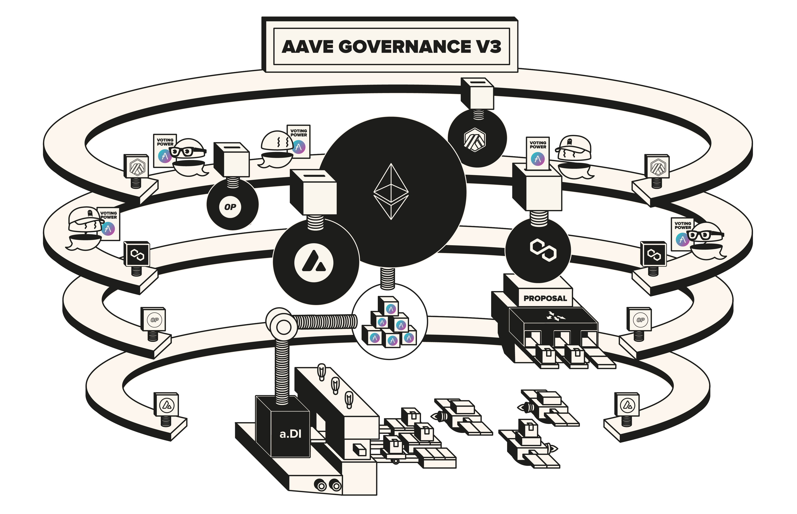

# Aave Governance v3

 

Aave Governance V3 is a smart contracts governance system enabling DAOs like Aave to create, vote and execute proposals in an efficient and scalable manner.

The architecture is multi-chain by design and powered by storage proofs, reducing significantly the cost of voting, while keeping the same levels of decentralization.

 

## Specifications

Extensive documentation about the architecture and design of the system can be found [HERE](./docs/overview.md).

Additional, more formal (but natural language) properties of the system can be found [HERE](./docs/properties.md)

 

## Setup instructions

All the information about setup of the project and deployments can be found [HERE](./docs/setup.md)

 

## Deployed Addresses

| Networks                                                                                                                                                                                                        | Governance                                                                                                            |
|-----------------------------------------------------------------------------------------------------------------------------------------------------------------------------------------------------------------|-----------------------------------------------------------------------------------------------------------------------|
| 

Ethereum

   | [0x9AEE0B04504CeF83A65AC3f0e838D0593BCb2BC7](https://etherscan.io/address/0x9AEE0B04504CeF83A65AC3f0e838D0593BCb2BC7) |

 

| Networks  | VotingMachine                                                                                                            |
|-----------|--------------------------------------------------------------------------------------------------------------------------|
| 

Ethereum

  | [0x06a1795a88b82700896583e123F46BE43877bFb6](https://etherscan.io/address/0x06a1795a88b82700896583e123F46BE43877bFb6)    |
| 

Polygon

   | [0x44c8b753229006A8047A05b90379A7e92185E97C](https://polygonscan.com/address/0x44c8b753229006A8047A05b90379A7e92185E97C) |
| 

Avalanche

 | [0x4D1863d22D0ED8579f8999388BCC833CB057C2d6](https://snowtrace.io/address/0x4D1863d22D0ED8579f8999388BCC833CB057C2d6)    |

 

| Networks                                                                                                                                                                                                 | PayloadsController                                                                                                               | Executor Lvl1                                                                                                                     | Executor Lvl2                                                                                                          |
|----------------------------------------------------------------------------------------------------------------------------------------------------------------------------------------------------------|----------------------------------------------------------------------------------------------------------------------------------|-----------------------------------------------------------------------------------------------------------------------------------|------------------------------------------------------------------------------------------------------------------------|
| 

Ethereum

    |  [0xdAbad81aF85554E9ae636395611C58F7eC1aAEc5](https://etherscan.io/address/0xdAbad81aF85554E9ae636395611C58F7eC1aAEc5)           | [0x5300A1a15135EA4dc7aD5a167152C01EFc9b192A](https://etherscan.io/address/0x5300A1a15135EA4dc7aD5a167152C01EFc9b192A)             | [0x17Dd33Ed0e3dD2a80E37489B8A63063161BE6957](https://etherscan.io/address/0x17Dd33Ed0e3dD2a80E37489B8A63063161BE6957)  |
| 

Polygon

      |  [0x401B5D0294E23637c18fcc38b1Bca814CDa2637C](https://polygonscan.com/address/0x401B5D0294E23637c18fcc38b1Bca814CDa2637C)        | [0xDf7d0e6454DB638881302729F5ba99936EaAB233](https://polygonscan.com/address/0xDf7d0e6454DB638881302729F5ba99936EaAB233)          | -                                                                                                                      |
| 

Avalanche

 | [0x1140CB7CAfAcC745771C2Ea31e7B5C653c5d0B80](https://snowtrace.io/address/0x1140CB7CAfAcC745771C2Ea31e7B5C653c5d0B80)            | [0x3C06dce358add17aAf230f2234bCCC4afd50d090](https://snowtrace.io/address/0x3C06dce358add17aAf230f2234bCCC4afd50d090)             | -                                                                                                                      |
| 

Arbitrum

    |  [0x89644CA1bB8064760312AE4F03ea41b05dA3637C](https://arbiscan.io/address/0x89644CA1bB8064760312AE4F03ea41b05dA3637C)            | [0xFF1137243698CaA18EE364Cc966CF0e02A4e6327](https://arbiscan.io/address/0xFF1137243698CaA18EE364Cc966CF0e02A4e6327)              | -                                                                                                                      |
| 

Optimism

    | [0x0E1a3Af1f9cC76A62eD31eDedca291E63632e7c4](https://optimistic.etherscan.io/address/0x0E1a3Af1f9cC76A62eD31eDedca291E63632e7c4) | [0x746c675dAB49Bcd5BB9Dc85161f2d7Eb435009bf](https://optimistic.etherscan.io/address/0x746c675dAB49Bcd5BB9Dc85161f2d7Eb435009bf)  | -                                                                                                                      |
| 

Binance

           |[0xE5EF2Dd06755A97e975f7E282f828224F2C3e627](https://bscscan.com/address/0xE5EF2Dd06755A97e975f7E282f828224F2C3e627)              | [0x9390B1735def18560c509E2d0bc090E9d6BA257a](https://bscscan.com/address/0x9390B1735def18560c509E2d0bc090E9d6BA257a)              | -                                                                                                                      |
| 

Base

                |  [0x2DC219E716793fb4b21548C0f009Ba3Af753ab01](https://basescan.org/address/0x2DC219E716793fb4b21548C0f009Ba3Af753ab01)           | [0x9390B1735def18560c509E2d0bc090E9d6BA257a](https://basescan.org/address/0x9390B1735def18560c509E2d0bc090E9d6BA257a)             | -                                                                                                                      |
| 

Metis

             | [0x2233F8A66A728FBa6E1dC95570B25360D07D5524](https://explorer.metis.io/address/0x2233F8A66A728FBa6E1dC95570B25360D07D5524)       | [0x6fD45D32375d5aDB8D76275A3932c740F03a8718](https://explorer.metis.io/address/0x6fD45D32375d5aDB8D76275A3932c740F03a8718)        | -                                                                                                                      |
| 

Gnosis

          | [0x9A1F491B86D09fC1484b5fab10041B189B60756b](https://gnosisscan.io/address/)        | [0x1dF462e2712496373A347f8ad10802a5E95f053D](https://gnosisscan.io/address/0x1dF462e2712496373A347f8ad10802a5E95f053D)         | -                                                                                                                      |
| 

Celo

          | [0xE48E10834C04E394A04BF22a565D063D40b9FA42](https://celoscan.io/address/0xE48E10834C04E394A04BF22a565D063D40b9FA42)        | [0x1dF462e2712496373A347f8ad10802a5E95f053D](https://celoscan.io/address/0x1dF462e2712496373A347f8ad10802a5E95f053D)         | -                                                                                                                      |
| 

Linea

          | [0x3BcE23a1363728091bc57A58a226CF2940C2e074](https://lineascan.build/address/0x3BcE23a1363728091bc57A58a226CF2940C2e074)        | [0x8c2d95FE7aeB57b86961F3abB296A54f0ADb7F88](https://lineascan.build/address/0x8c2d95FE7aeB57b86961F3abB296A54f0ADb7F88)         | -                                                                                                                      |
| 

Scroll

          | [0x6b6B41c0f8C223715f712BE83ceC3c37bbfDC3fE](https://scrollscan.com/address/0x6b6B41c0f8C223715f712BE83ceC3c37bbfDC3fE)        | [0xc1ABF87FfAdf4908f4eC8dc54A25DCFEabAE4A24](https://scrollscan.com/address/0xc1ABF87FfAdf4908f4eC8dc54A25DCFEabAE4A24)         | -                                                                                                                      |
| 

Soneium

          | [0x44D73D7C4b2f98F426Bf8B5e87628d9eE38ef0Cf](https://soneium.blockscout.com/address/0x44D73D7C4b2f98F426Bf8B5e87628d9eE38ef0Cf)        | [0x47aAdaAE1F05C978E6aBb7568d11B7F6e0FC4d6A](https://soneium.blockscout.com/address/0x47aAdaAE1F05C978E6aBb7568d11B7F6e0FC4d6A)         | -                                                                                                                      |
| 

Sonic

          | [0x0846C28Dd54DEA4Fd7Fb31bcc5EB81673D68c695](https://sonicscan.org/address/0x0846C28Dd54DEA4Fd7Fb31bcc5EB81673D68c695)        | [0x7b62461a3570c6AC8a9f8330421576e417B71EE7](https://sonicscan.org/address/0x7b62461a3570c6AC8a9f8330421576e417B71EE7)         | -                                                                                                                      |
| 

ZkSync

          | [0x2E79349c3F5e4751E87b966812C9E65E805996F1](https://era.zksync.network/address/0x2E79349c3F5e4751E87b966812C9E65E805996F1)        | [0x04cE39789e11a49595cD0ECEf6f4Bd54ABF4d020](https://era.zksync.network/address/0x04cE39789e11a49595cD0ECEf6f4Bd54ABF4d020)         | -  
| 

Ink

          | [0x44D73D7C4b2f98F426Bf8B5e87628d9eE38ef0Cf](https://explorer.inkonchain.com/0x44D73D7C4b2f98F426Bf8B5e87628d9eE38ef0Cf)        | [0x47aAdaAE1F05C978E6aBb7568d11B7F6e0FC4d6A](https://explorer.inkonchain.com/address/0x47aAdaAE1F05C978E6aBb7568d11B7F6e0FC4d6A)         | -                                                                                                                      |
| 

Plasma

          | [0xe76EB348E65eF163d85ce282125FF5a7F5712A1d](https://plasmascan.to/address/0xe76EB348E65eF163d85ce282125FF5a7F5712A1d)        | [0x47aAdaAE1F05C978E6aBb7568d11B7F6e0FC4d6A](https://plasmascan.to/address/0x47aAdaAE1F05C978E6aBb7568d11B7F6e0FC4d6A)         | -                                                                                                                      |
| 

Bob

          | [0x17fa87007bfF1dC7e6b3a36ED936E6355e37237C](https://explorer.gobob.xyz/address/0x17fa87007bfF1dC7e6b3a36ED936E6355e37237C)        | [0x90800d1F54384523723eD3962c7Cd59d7866c83d](https://explorer.gobob.xyz/address/0x90800d1F54384523723eD3962c7Cd59d7866c83d)         | -                                                                                                                      |

 

## Security

### V1

The following security procedures have been applied:
- Extensive testing and internal review by the BGD Labs team.
  - [Tests suite](./tests).

- We have engaged [Emanuele Ricci](https://twitter.com/stermi) as external security partner in middle stages of the project, with outstanding results. This procedure was focused on non-biased modelling of the system in terms of flows and any kind of security problem and/or state inconsistency, keeping a tight feedback loop with the development team.

- Extensive properties checking (formal verification) procedure by [Certora](https://www.certora.com/), a security service provider of the Aave DAO.
  - [Report](./security/certora/Formal_Verification_Report_Aave_Governance_V3.md).
  - [Properties](./security/certora).

- Security review by [SigmaPrime](https://sigmaprime.io/), another security service provider of the Aave DAO.
  - [Reports](./security/sp).
  - [Test suite](https://github.com/sigp/aave-public-tests/tree/main/aave-governance-v3/tests).

### Dependency update on VotingMachine

Due to a problem found on the [MerklePatriciaTrieVerifier](https://hackmd.io/@agureevroman/Sk9gl-zVll) dependency of the Voting Machine's allowing for a minor voting DOS, the dependency required a fix and replacement of the Voting Machines.

  - [Code diff](https://github.com/bgd-labs/aave-governance-v3/commit/1688caacfa7f9efef7947e561c27b1f6f5271bbb#diff-420b9402f23b3e74d290b0ded7395303ce4e353d6ee46c1dcf5b4566da7c8f76)
  - [Test suite](./tests/voting/DataWarehouse_integration.t.sol)
  - [Security review](./security/certora/reports/MerklePatriciaTrieVerifier_Fix_Review_Report.pdf) by [Certora](https://www.certora.com/)
  - [Proposal](https://vote.onaave.com/proposal/?proposalId=273&ipfsHash=0xc5e038044cd09bdb8aa05b27a480f3fcb0971932bb709b6ffcca8cfe4728c0d3) activating new VotingMachines

**IMPORTANT**. The BUSL1.1 license of this repository allows for any usage of the software, if respecting the *Additional Use Grant* limitations, forbidding any use case damaging anyhow the Aave DAO's interests.

## Deployments

On the [scripts](./scripts/) folder you can find everything necessary to deploy the governance contracts (commands can be found in the [Makefile](./Makefile)). 
In the case you want to add a new network, you will first need to add the path in [GovBaseScript.sol](./scripts/GovBaseScript.sol). 
(Take into account that the network needs to have been added previously in solidity-utils repo, then update the dependency on aave-delivery-infrastructure, and then adi-deploy (on which this repo depends on)).

## License

Copyright © 2025, Aave DAO, represented by its governance smart contracts.

Created by [BGD Labs](https://bgdlabs.com/).

The default license of this repository is [BUSL1.1](./LICENSE), but all interfaces and the contents of the following folders are open source, MIT-licensed:
- [Data helpers](./src/contracts/dataHelpers/)
- [Misc libraries](./src/contracts/libraries/)
- [Voting libraries](./src/contracts/voting/libs/)

**IMPORTANT**. The BUSL1.1 license of this repository allows for any usage of the software, if respecting the *Additional Use Grant* limitations, forbidding any use case damaging anyhow the Aave DAO's interests.
