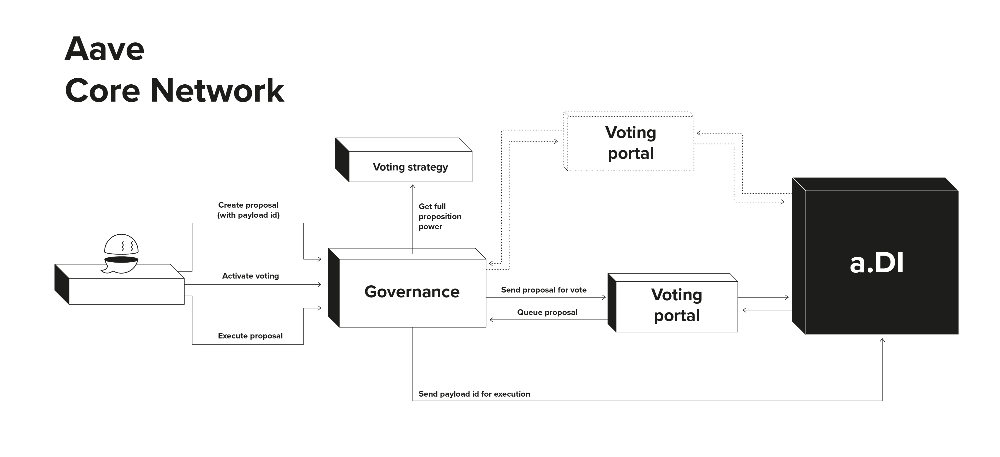
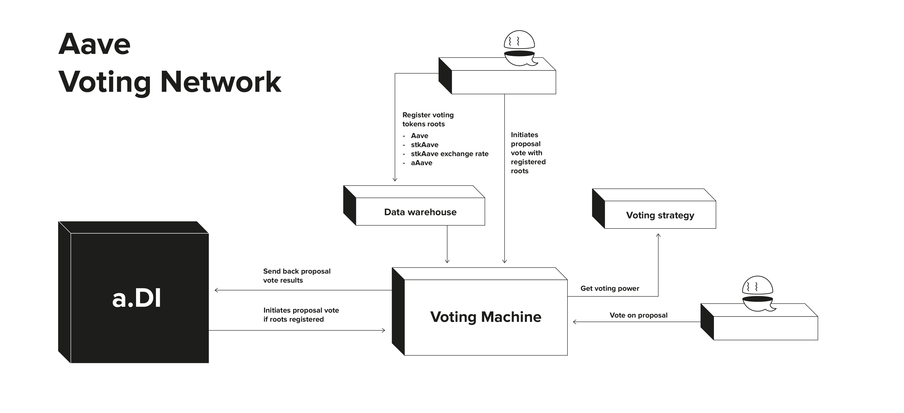
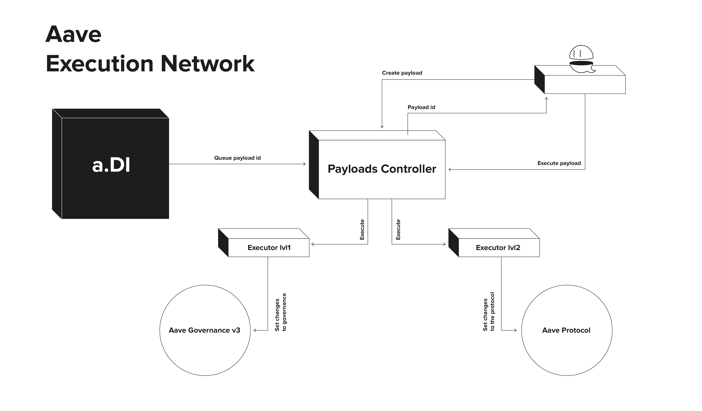
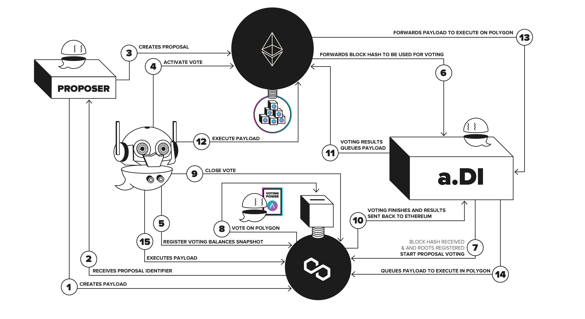
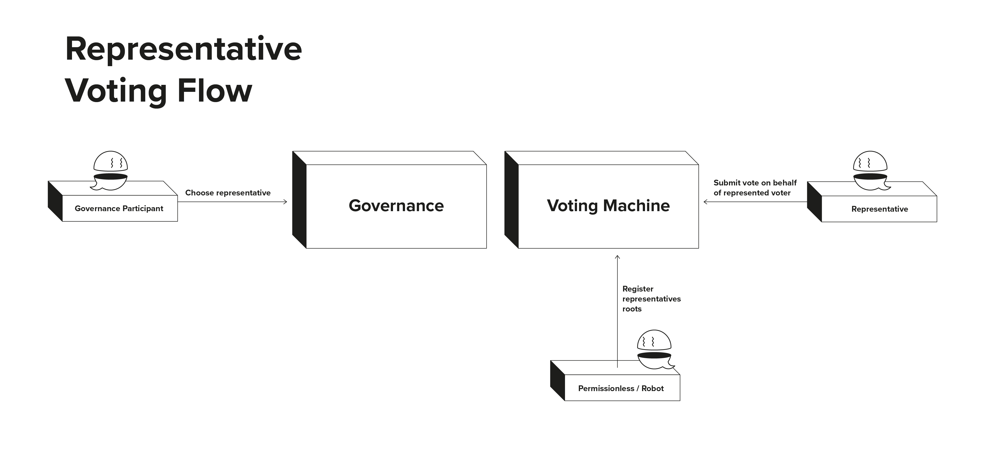

This documents tries to present a high and (partially) low level view of the architecture of Aave Governance v3.

# Architecture

Aave Governance v3 has a pretty modular architecture, but opinionated to cover the average needs of an on-chain DAO like Aave.
Conceptually (and usually spacially), the components are divided into 3 sections, heavily tied to lifecycle of proposals:
- **Core Network**. Settlement and security layer of the governance system, living on the network where accounting of voting power resides (e.g. Ethereum, as balances of AAVE, stkAAVE, aAAVE are stored there). All the high-level validations on proposals lifecycle happen here.
- **Voting Networks**. Environment where voting based on storage proofs happens. Generally, these will be less secure environment than Core, but consequently faster and cheaper. Still, the network chosen as Core should always be Voting Network too, as last resort fallback.
Voters with balance on Core network interact directly with the Voting Network to participate in proposals.
- **Execution Networks**. Networks where the execution of proposal payloads happens, and also where these payloads are registered pre-proposal. For example, with the Aave Governance executing a payload on Polygon, Polygon is an Execution Network, where this payload will be first registered and later executed.

Generally, in a Aave Governance v3 setup there will be 1 Core network, multiple Voting Networks (including Core) and multiple Execution Networks (including all Voting Networks and Core).

The communication between all Networks is handled by [a.DI](), a system developed in parallel with Aave Governance v3, but completely standalone and that can be considered as a "black box" in the context of this document.

 

## Core Network

The Core network (Ethereum in the case of Aave governance) is the settlement layer of proposals, where voting power resides in terms of balances, and where high-level validations are applied.

 

It is composed by the following smart contracts:
- [Governance](../src/contracts/Governance.sol): Main contract of the Governance V3 system, which in technical
  terms, could be defined as a controller (deciding how, where, and when
  proposals “move” to other components) and access control component (deciding who can do certain actions like creation
  of proposals, or whitelisting all other components, like voting networks or voting strategies).
  
  More precisely, this contract:
  - Allows to create proposals, by passing all the information about them, including payload/s id registered into the Execution Network/s.
  - Validates that proposal creators have enough AAVE proposition power during all the proposal flow.
  - Decide from which Ethereum block a “snapshot” will be taken to consider balances for voting.
  - Enforce "time" requirements: `coolDownBeforeVotingStart` (time that should pass between proposal creation and voting start, in seconds), `votingDuration` (duration of the vote in seconds) and `PROPOSAL_EXPIRATION_TIME` (maximum time from payload creation until it gets forwarded to the Execution Network).
  - Enforce “success” metrics of results received from Voting Network: threshold of minimum YES votes and vote differential between YES and NO.
  - Manages forwarding of approved proposals to Execution Network, once voting is successful.
  
  The permissioned entities on Governance are:
  - **Proxy admin**. With upgradeability permissions.
  - **Owner**. With permissions over basic/global parameters of the governance, like voting strategy logic, voting configs of whitelisted connected contracts.
  - **Guardian**. With permissions to cancel proposals and fix the voting portal's connection in case of misconfiguration. 

- [GovernancePowerStrategy (GPS)](../src/contracts/GovernancePowerStrategy.sol): immutable contract defining the logic of how to calculate proposition power. In order to simplify the architecture, it also contains the logic for calculation of voting power.

- [VotingPortal (VP)](../src/contracts/VotingPortal.sol): immutable contract with the logic of how and where to send
  a proposal for voting, and how to parse the received vote results. There should be one VP per relation `Governance` <-> `VotingMachine`.

## Aave Voting Networks

An Aave Voting Network is the voting layer of proposals, generic, but targeting low transaction cost environments like L2s or other non-Ethereum blockchains.

**Voting via storage proofs**

To be able to emit votes on any network using the balance on the Core network, the system uses block hashes as the source of information for voting balances, and storage proofs as the core mechanism for validation.
For a any proposal, the system takes a “snapshot” (block hash of the block before `activateVote` method gets called) of voting token balances/delegations at exactly 1 point in time in the Core network, forwards it to an Aave Voting Network and sets it as the main source of balances/delegation to validate against whenever an address submits a vote there.

Simplifying the technicalities, Ethereum block hashes contain the so-called state tree of the network, which in turn
contains all the data of all the smart contracts that exact block. Amongst those
contracts, AAVE, stkAAVE, and other voting assets are present, and within them, the balances and delegations of all
Ethereum addresses.
So the system “has” all the data needed to verify if somebody has voting power to participate in a proposal.

On the other hand, storage proofs are a mechanism allowing to cryptographically prove that a piece of data is
contained in a tree. In this case, they allow proving that a specific address has voting balance/delegation on
the state tree of an Ethereum block. So what happens in practice when somebody votes is that the voter itself inputs
how much balance of the voting asset/s he had at that Ethereum block (instead of the system reading it), together with
a storage proof over the Ethereum block hash for that proposal.
The Voting network only takes care of cryptographically verify the storage proof against the Ethereum block data together with all extra validations (e.g. no double-voting) and accounting.

 

The Aave Voting Network is composed by the following contracts:
- [VotingMachine](../src/contracts/voting/VotingMachine.sol): smart contract deployed on each Voting Network that contains all the logic for emitting, validating and accounting votes.
Additionally, it contains the logic to initiate voting of proposals, together with sending results to the Core network once voting is closed.
The Voting Machine doesn’t deal with the proposal “success” validations, it only cares about voting duration (bridged from governance chain), which will indicate how long a vote will stay open. Once that time period ends, voting is closed and a YES/NO count is forwarded back to the Core side of the Governance.

  It is important to note that one VotingMachine is also deployed on Ethereum in case of emergency. Even if not expected
and not optimal cost-wise, if a catastrophic scenario would not allow any other Voting Network to operate, Ethereum
itself will have its own Voting Machine, allowing the whole system to mirror Aave Governance V2.

  Regarding permissions:
  - The owner entity can update the gasLimit used to send back the vote results, together with the voting portal: address to send/receive messages (initiate vote, send results back).

 

- [VotingStrategy](../src/contracts/voting/VotingStrategy.sol): immutable contract that defines the tokens with voting power, and all the logic on how to fetch and calculate it. One VotingStrategy is set for a `VotingMachine``, if there is a need to change it (e.g. add / remove tokens) a new VotingMachine with a new VotingStrategy will need be deployed.

 

- [DataWarehouse](../src/contracts/voting/DataWarehouse.sol): immutable contract to store tree roots and slot values for a block hash and accounts, used to get voting power (or other information) via storage proofs.

  The voting token roots and slot values need to be registered before voting on a proposal can be started. The methods to register roots and slot values are generic, so it will work with any token and any roots / values.

  The DataWarehouse is a permissionless contract.

 

## Aave Execution Networks

The Execution networks have a dual character on governance v3: they are the environments where proposal payloads are created (code to be executed when a proposal passes), and also as the name says, where these payloads are finally executed.

The Execution networks have a granular mechanism of incremental access control: covering the same granularity of access control levels as v2 (Level 1, Level 2), but also allowing to have in the same proposal payloads with different Levels, by understanding which is the maximum level within the set, and enforcing it. 

On Governance V3 the payloads, apart from being deployed before proposal creation, need to be registered in the Payloads Controller on the network of choice.
This allows getting an identifier of each payload that the proposer needs to submit on the proposal creation in Ethereum, which gives important benefits in terms of multi-chain traceability.

The Aave Execution Network is composed by the following contracts:

- [Executor](../src/contracts/payloads/Executor.sol): Immutable contract only in charge of executing payloads and hold permissions. Depending on which permissions the Executor holds, it will be assigned an [access level](../src/contracts/payloads/PayloadsControllerUtils.sol).
For example on Avalanche, Aave will probably only have 1 Executor, with permissions on Aave V3 Avalanche.
But on Ethereum, the current short/long executor system on Governance v2 will be mirrored in 2 Executors (Level 1/Level 2).

  The Executor contract/s can hold funds that can be used when executing a payload.
If any change in logic is needed, the Executor/s should be migrated to a new one, to be registered into the corresponding PayloadsController.

  Regarding permissions:
  - The owner is the only entity that can execute payloads via its `executeTransaction()` function. This role will always be given to the PayloadsController. 

 

- [PayloadsController](../src/contracts/payloads/PayloadsController.sol): contract acting as both registry of payloads, and "controller" mechanism deciding when and under which conditions to execute them via Executors.

  Creation of payloads is permissionless: anybody can call `createPayload()` with 1:N actions (CALL/DELEGATECALL executables). This will register the payload and return a `payloadId`, which should be inputted then on the Core Network when submitting a proposal.

  The execution stage works as:
  - Once a proposal fully passes on Core network, a message is sent to the PayloadsController (usually via a.DI) for execution.
  - The payload gets validated, and queued in a timelock mechanism.
  - After the timelock, anybody can permissionless execute the payload by calling `executePayload()`, which will forward it to the corresponding Executor.

   

  If any of the actions inside the Payload require funds (e.g. ETH) to be executed, there are two ways that payload can be funded for execution:
  - *Pre-funding*: sending the required funds to the Executor contract (take into account which Executor is needed) so payload will use the funds there.
  - *Direct funding*: The caller of `executePayload()` will use its own funds to enable payload execution, via `msg.value`.

   

  Regarding permissions:
    - Only a.DI can send messages to notify about successful proposals, and queue payloads.
    - There is an owner capable of adding/remove executors (to be configured as one of the Executor contracts), together with rescuing funds sent by mistake.
    - Additionally, a Guardian can cancel malicious/wrong payloads, if they have not been executed or expired.
    - The contracts is upgradeable, with the upgradeability recursively controlled by the most strict Executor level. 

 

## Proposal lifecycle

 

For a better overview of the full flow, the end-to-end steps are the following:

1. An address (can be the proposer or anybody else) creates the proposal payload/s, containing the logic that will be
  executed if the proposal passes, and registers it into the `PayloadsController`` of the target network.
  For example, if the proposal will list an asset on Aave v3 Avalanche, the payload smart contract containing the listing logic will need to be deployed on Avalanche, and its address registered on the PayloadController Avalanche.
  Important to highlight that this is a permissionless action, as by registering the payload, there is no obligation of creating any final governance proposal using it. 
 It is possible to deploy & register multiple payloads in multiple
  networks to be used on the same proposal.

2. When registering the payload on the Payload Controller of the target network, this will return a sequential identifier:
  1 for the first payload registered, 2 next, and so on. This will be used on the Core network to reference the payload on proposal creation stage (3).

3. On Ethereum (Core network), the proposer with the required AAVE proposition power, creates the proposal by transacting with the core governance smart contract. The proposer will input in that transaction the payload ids (and their networks) to execute, together with the Voting Network for the proposal.

4. After the delay period is over, the Aave Robot (automation mechanism) or any other Ethereum address will be able to activate the proposal. In practice, this means that the Ethereum block just before this action is taken as a “snapshot” of the Ethereum blockchain state, and sent to the Voting Network to be used as a source of the voting power.

5. On the Voting Network, a permissionless “settlement” of global data to be used for vote
   validation will need to be done, by the Aave Robot, or any other address: the Ethereum block hash, its state tree,
   and the state roots of the voting assets.
   This can be done both before (via counterfactuals) or after receiving the block hash.

6. In parallel with step 5, by using a.DI, the information about the vote (Ethereum block hash mainly) gets forwarded to the Voting Network. 

7. Voting starts on the Voting Network.

8. Everybody with voting power on Ethereum is able to vote on the Voting Network, by interacting with the Voting Machine smart contract.

9. After the voting period passes, the Aave Robot or any address can call a function on the Voting Machine to close the vote, not allowing anybody else to participate.

10. Voting results in the form of a count of YES and NO are sent to Ethereum, via the Aave Cross-chain Infrastructure.

11. Voting results arrive at the core governance contract on Ethereum, which after validating its success requirements, will queue them for execution. Currently, this queuing doesn't have any timelock, as that time delay is managed on the side on the Execution network.

12. Aave Robot or any other address will initiate the execution of the payloads.

13. Confirmation that the vote has passed is sent to the corresponding PayloadsController contract on Ethereum or any other compatible network (via a.DI).

14. The proposal payload/s are queued on the corresponding PayloadsController/s.

15. Execution by Aave Robot or any other address, once the time-lock is finished.

 

## Miscellaneous

 

**Voting representatives**

It is fairly frequent (and default) that when deploying same contract on different networks, their addresses will be different. This is problematic for the new model of voting because a situation like the following could unfold:
  - Address A delegates voting power to a Gnosis Safe multisig B on Ethereum.
  - The members of the Safe B have another Safe of the Voting network (e.g. Polygon), but with address C.
  - In order for B to vote on Polygon, a transaction should be submitted on Polygon by address B there. But that address is simply empty on Polygon, different to C.
To solve this challenge and allow any smart contract to vote on the Voting Network, we have introduced the role of a **representative**.

 

**Cancellation fee on creation**

Any address on the Core Network (Ethereum) can choose one representative address per Voting Network. In the previous example, Safe B would select Safe C as its representative on Polygon, so C will be able to vote on all proposals there.
- On proposal creation, a small "cancellation fee" in ETH needs to be included in the transaction. The rationale of it is covering cancellation cost of the proposal, to avoid any kind of spam attack based on flash loans.
Once the proposal transitions to any "completed" state, any address can trigger the return of the fee back to the proposal creator. But if the proposal gets cancelled, the Aave DAO will receive the cancellation fee to cover costs.