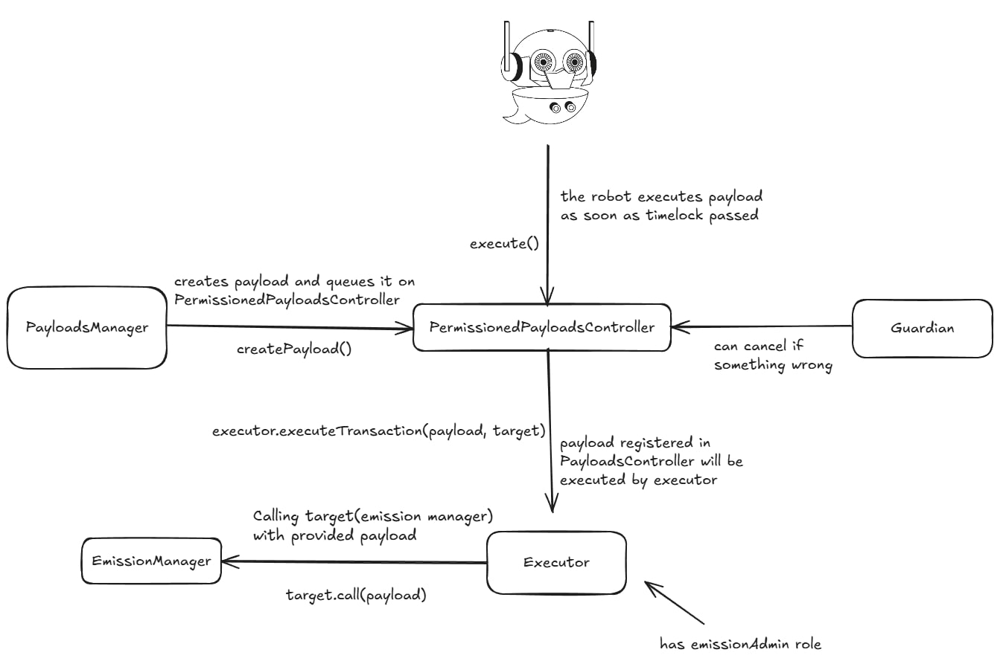

## Permissioned payloads controller overview

[PermissionedPayloadsController](/src/contracts/payloads/PermissionedPayloadsController.sol): This is an extension of the PayloadsController contract, that modifies it so that only accepted actors (PayloadManager) can register a payload. The objective of having such extension is so that allowed third parties  to affect change into low risk parts of the protocol, using similar processeces as governance. For that a new Executor contract will be registered to this Permissioned Payloads Controller, that will hold limited permissions.
At launch it will have permissions to change the LM programs.
    
  **Key points and differences from PayloadsController**:
    
  - Contract includes a payloads manager role with permission to create and cancel payloads.
  - Payload creation is permissioned: only the payloads manager can create payloads.
  - Contract has a guardian role to review created payloads and cancel them if incorrect or unrecognized.
  - The guardian can adjust the timelock within certain limits.
  - Payloads manager and guardian have equal permissions to cancel payloads. Payloads can be cancelled if not expired or executed.
  - Payload execution is permissionless. If the timelock has passed and the payload isn't cancelled or expired, anyone can execute it. The Aave-robot is responsible for executing payloads.
  - Executor holds permission emission admin role.
    
  **The execution process operates as follows**:
    
  1. A trusted entity creates a payload of any kind and submits it to the permissioned payloads controller.
  2. Payload creation is combined with queuing: once created, a payload is automatically queued. The payload ID returned from the createPayload() function can be used to cancel or execute the payload.
  3. The payload is assigned a timelock. During this timelock period, the guardian can verify the validity of the payload. If the payload is deemed invalid or unrecognized, the guardian can cancel it. The payloads manager also has the authority to cancel it.
  4. Once the timelock period ends and the payload is unlocked and not expired, anyone is permitted to execute it.

