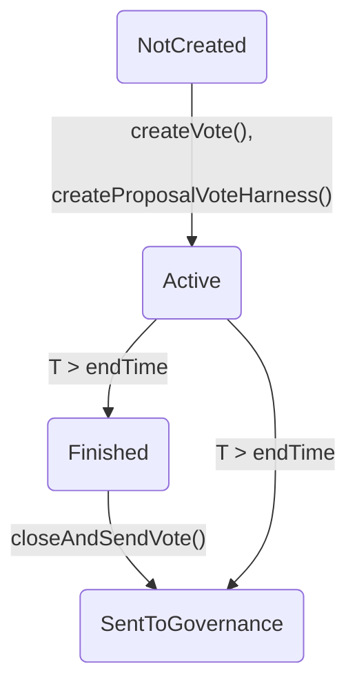

# Voting Machine spec

## Open issues and questions

### Voting issues
* How to verify `_registerBridgedVote`? Harness it and test together with `settleVoteFromPortal`?

### Proposal configuration issues
* It is possible to call `_createBridgedProposalVote` without reverting, but fail
  to start the proposal's vote. Can this lead to undesirable situations?
* It follows that there can be proposal configs while the relevant proposal vote 
  state is `NotCreated`. E.g. if the needed roots are missing from the `DataWarehouse`,
  see `startedProposalHasConfig` invariant.
* Should we verify `getProposalsVoteConfigurationIds`? If so, how?

## Basic setup
There are two setups used for rules here:
1. Basic setup in [`setup.sepc` file](./setup.spec)
2. Complicated setup summarizing `getVotingPower` in
   [`power_summary.spec`](./power_summary.spec) presented below

Here we deal with the basic setup in the [`setup.spec` file](./setup.spec).

### Harness

* **VotingMachineHarness**  
  Adds two useful methods:
  * `submitVoteSingleProof` - vote without needing an array of proofs
  * `createProposalVoteHarness` - A way to call `_createBridgedProposalVote` from spec
  
* **VotingStrategyHarness**
  Adds:
  * `is_hasRequiredRoots` - returns true if `hasRequiredRoots` did not revert
  * `getVotingAssetListLength`

### Summarized

* **IVotingStrategy.getVotingPower** => NONDET
* **DataWarehouse.getStorage** => NONDET
* **CrossChainController.forwardMessage** => NONDET
* **SlotUtils.getAccountSlotHash** => NONDET

## Voting Power Summary setup
This complicated setup is done in the [`power_summary.spec` file](./power_summary.spec).
It is used only in [`misc.spec` rules](./misc.spec).

### Harness

* **VotingMachineHarnessTriple**  
  In addition to the methods in **VotingMachineHarness** adds:
  * `submitVoteTripleProof` - for voting using three proofs without needing an array
  
* **VotingStrategyHarness** - same as above

* **DelegationModeHarness**  
  Since `DelegationMode` is not part of any contract, it cannot be used in spec.
  This harness solves the problem by providing an equivalent enum `Mode`.

### Summarized

* **IVotingStrategy.getVotingPower(...)**  
  Returns the voting power. Summarized as constant per power (balance), asset
  and storage-slot. Note a wildcard contract is used in this summary.

* **DataWarehouse.getStorage(...) -> SlotValue**  
  Summarized, only requiring `slotval.value > 0` where `slotval` is the return value.

* **CrossChainController.forwardMessage** => NONDET

* **SlotUtils.getAccountSlotHash** => NONDET

## Voting and tally
Rules from [`voting_and_tally.spec` file](./voting_and_tally.spec).

### Definitions

* **Votes tally**  
  The *votes tally* for a proposal is the pair (2-tuple) of votes in favor and votes
  against, i.e. `(forVotes, againstVotes)`.
* **Stored voting power**  
  The *stored voting power* of a voter `v` for a proposal `i` is the field
  `getUserProposalVote(v, i).votingPower`.
* **A vote was cast**  
  We say that *a vote was cast* for a proposal `i` if the exists a voter `v`
  whose stored voting power for `i` changed from zero to positive.
 
### Rules summary
This spec proves that in a single method call:
1. The voting tally for proposal $i$ changed if and only if a single voter cast a vote
   for proposal $i$
2. At most one voter can cast a vote on one proposal
3. When a vote is cast on a proposal, the proposal's votes tally changes accordingly
4. The voting tally can be changed only using one of the voting methods
   (rule `onlyVoteCanChangeResult`).
5. The voting tally in favor and against can only increase, and their sum equals
   the sum of stored voting powers for that proposal

### Ghosts

* `is_someoneVoting(uint256) -> bool`  
   Indicating a vote was cast for the given proposal.
* `number_stores() -> mathint`  
   The number of times values have been stored in voting map.
* `storedVotingPower(uint256, address) -> uint248`  
   Ghost function following stored votes mapping.

### Casting Votes Rules

* **votingPowerGhostIsVotingPower(uint256 proposalId, address voter)**  
  Invariant showing the ghost `storedVotingPower` is indeed the stored vote power,
  i.e. equals `getUserProposalVote`. From this it follows that if a vote is cast on
  proposal `i` then `is_someoneVoting(i)` is true.

* **sumOfVotes(uint256 proposalId)**  
  Invariant showing that for each proposal $i$ the sum of votes in favor and against
  equals the sum of stored voting powers, i.e.  
  $\mathtt{prop.forVotes} + \mathtt{prop.againstVotes} = \sum_{\mathtt{address}\ a} \mathtt{storedVotingPower}(i, a)$  
  where `prop = getProposalById(i)`.

* **voteTallyChangedOnlyByVoting(method f, uint256 proposalId)**  
  If a proposal's votes tally changed then a vote was cast on the proposal.

* **voteUpdatesTally(method f, uint256 proposalId, address voter)**  
  If a vote was cast for a proposal, then the proposal's votes tally changed.
  Moreover, the change in tally corresponds to the vote that was cast.
  See also [votedPowerIsImmutable rule](#votedPowerIsImmutable).

* **onlyVoteCanChangeResult(method f, uint256 proposalId)**  
  Vote tally can be changed only by one of the voting methods.

* **votingTallyCanOnlyIncrease(method f, uint256 proposalId)**  
  Voting tally can only increase (either votes in favor or votes against increased).

### Other proposals and voters

* **strangerVoteUnchanged(method f, uint256 proposalId, address stranger)**  
  A stranger's stored vote is unchanged when another votes.

* **otherProposalUnchanged(method f, uint256 proposalId, uint256 otherProposal, address otherVote)**  
  Only a single proposal's tally and votes may change by a single method call.

* **otherVoterUntouched(method f, uint256 proposalId, address voter, address strange)**  
  Only a single voter's stored voting power may change (on a given proposal).

## Voting legality
Rules from [`legality.spec` file](./legality.spec).

### Rules summary

The section, together with [Voting and tally](#voting_and_tally) and [Proposal states](#proposal_states),
shows that:

A vote can be rejected only for one of the following reasons (otherwise must be accepted):
* Voting twice on behalf of particular user (rule `votedPowerIsImmutable` together
  with results from `voting_and_tally.spec`)
* Voting before vote start (rule `onlyValidProposalCanChangeTally` and `states.spec`)
* Voting after vote end (rule [onlyValidProposalCanChangeTally](#onlyValidProposalCanChangeTally)
  and [Proposal states](#proposal_states))
* Voting with 0 voting power (rule [legalVote](#legalVote))

### Rules

* **votedPowerIsImmutable(method f, address voter, uint256 proposalId)**  
  
  Stored voting power is immutable (once positive).
  Proves that stored voting power can change only when the original value is zero,
  and that once it is positive it is immutable. This rule, together with the
  previous section proves that a voter cannot vote twice.

* **onlyValidProposalCanChangeTally(method f, uint256 proposalId)**  
  
   Vote tally can change only for active, properly configured, proposals.

* **legalVote(method f, uint256 proposalId, address voter)**  
  
  Vote tally may change only if voter had zero stored voting power before and positive after.  

## Proposal configuration
Rules from [`proposal_config.spec` file](./proposal_config.spec).

### Rules summary

* A vote can be created for a proposal only if the proposal has a configuration with a non-zero
  block hash
* If a vote is created for a proposal, then the required roots exist
* The proposal's configuration is immutable
* A new must have unused ID.

### Rules

* **startedProposalHasConfig(uint256 proposalId)**  
  When starting a proposal vote it already has a configuration (with non-zero block hash).
  An invariant.  
  **Note** that the opposite need not be true. For example, a in `_createBridgedProposalVote`
  (which creates the configuration) the call to `createVote(proposalId)` may revert,
  and since it is inside a `try` clause the original call will not revert.

* **createdProposalHasRoots(uint256 proposalId)**  
  Once a proposal vote is started the required roots (in the `DataWarehouse`) exist. An invariant.

* **proposalHasNonzeroDuration**  
  An existing proposal's voting duration is non zero.

* **newProposalUnusedId(uint256 proposalId, bytes32 blockHash, uint24 votingDuration)**  
  A new proposal must have an unused ID.

* **configIsImmutable(method f, uint256 proposalId)**  
  A proposal's configuration is immutable once set.

## Proposal states

Rules from [`proposal_states.spec` file](./proposal_states.spec).

### Rules summary

* Start time of a proposal's vote is before its end time
* A proposal vote's ID is immutable
* The proposal states are as described in the state-machine below

### Rules

* **startsBeforeEnds(uint256 proposalId)**  
  A proposal's vote start time is before (or equal to) its end time. An invariant.

* **startsStrictlyBeforeEnds(uint256 proposalId)**  
  A started proposal's end time is the start time plus voting duration. An invariant.  
  This fails on `createProposalVoteHarness` since we allow `l1ProposalBlockHash` to be zero.
  For example, we can have a created proposal vote with `l1ProposalBlockHash == 0` but
  `endTime > 0`, now calling `_createBridgedProposalVote` can modify the `votingDuration`,
  making the invariant false.

* **proposalLegalStates(uint256 proposalId)**  
  A proposal must be in one of the following states:

  1. $\mathtt{NotCreated} \Longleftrightarrow \mathtt{endTime} = 0$
  2. $\mathtt{Active} \Longleftrightarrow (t \leq \mathtt{endTime}) \land (\mathtt{endTime} \neq 0)$
  3. $\mathtt{Finished} \Longleftrightarrow (t \geq \mathtt{endTime} > 0) \land \neg \mathtt{sentToGovernance}$
  4. $\mathtt{SentToGovernance} \Longleftrightarrow (t \geq \mathtt{endTime} > 0) \land \mathtt{sentToGovernance}$

* **proposalMethodStateTransitionCompliance(method f, uint256 proposalId)**  
  A proposal's valid state transitions by method call.

* **proposalTimeStateTransitionCompliance(uint256 proposalId)**  
  A proposal's valid state transitions by time.

* **proposalImmutability(method f, uint256 proposalId)**  
  Proposal immutability. Verifies that certain fields of the proposal are immutable,
  once the proposal is created of course).

* **proposalIdIsImmutable(uint256 proposalId)**  
  A created proposal vote's ID is never changed. An invariant.

## Miscellaneous
Rules from [`misc.spec` file](./misc.spec). Mostly rules dealing with specific methods.

**Note.** Uses the [`power_summary.spec` setup](./power_summary.spec).

### Rules

* **sendOnlyFinishedVote(uint256 proposalId)**  
  Only proposals in the state `Finished` can be sent to governance

* **submitSingleProofVerification(...)**  
  Verifies compliance of
  `submitVoteSingleProof(uint256 proposalId, bool support, VotingBalanceProof proof)`, this is
  a harness method that sends a single proof.

* **submitTripleProofVerification(...)**  
  Verifies compliance of `submitVoteTripleProof`.  

* **rejectEquivalentProofs(...)**  
  Reject equivalent proofs. If several equivalent proofs are given (same asset and slot) they should
  be rejected.  
